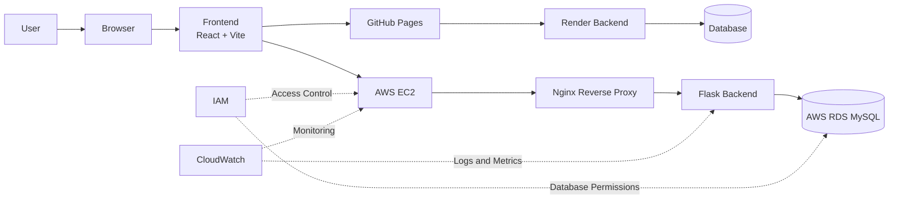

# Smart Pilgrim Companion System Architecture

Smart Pilgrim Companion is a cloud-based spiritual travel and temple assistance platform. The system combines a React + Vite frontend with backend deployment options for both hosted cloud services and AWS infrastructure.

## Architecture Diagram

## Benefits

- Provides a scalable web architecture for spiritual travel planning and temple assistance.
- Supports flexible deployment through GitHub Pages, Render, and AWS.
- Uses Nginx as a reverse proxy to route production traffic securely to the Flask backend.
- Stores structured pilgrim, temple, planning, and recommendation data in MySQL through AWS RDS.
- Improves reliability and observability with CloudWatch logs and metrics.
- Applies IAM-based access management for controlled AWS resource permissions.
