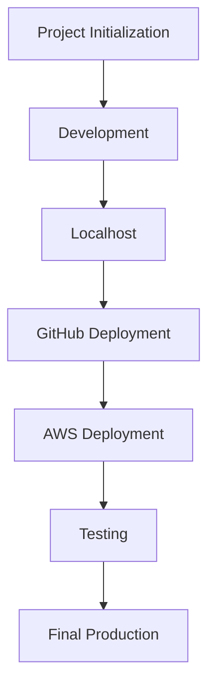

# Deployment Flow

This workflow shows the project lifecycle from initialization through final production deployment and testing.

## Deployment Workflow Diagram

## Flow Summary

- Project Initialization defines the application scope, tools, and repository structure.
- Development covers frontend, backend, database, and integration work.
- Localhost testing validates the application before cloud deployment.
- GitHub Deployment publishes the frontend and maintains source control.
- AWS Deployment hosts production-ready backend and database services.
- Testing verifies functionality, routing, database connectivity, and user workflows.
- Final Production represents the completed academic submission-ready system.
