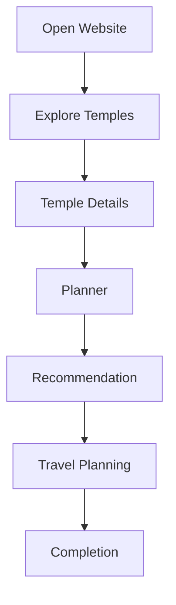

# User Journey

This user journey describes how a pilgrim interacts with Smart Pilgrim Companion from opening the website to completing the travel planning workflow.

## User Flow Diagram

## Journey Summary

- The user opens the Smart Pilgrim Companion website.
- The user explores available temples and spiritual destinations.
- The user views temple details such as location, description, and relevant travel context.
- The planner helps organize the pilgrimage route and visit schedule.
- Recommendations assist the user with temple selection and planning decisions.
- Travel planning prepares the user for the journey.
- Completion marks the end of the planned pilgrim assistance workflow.
