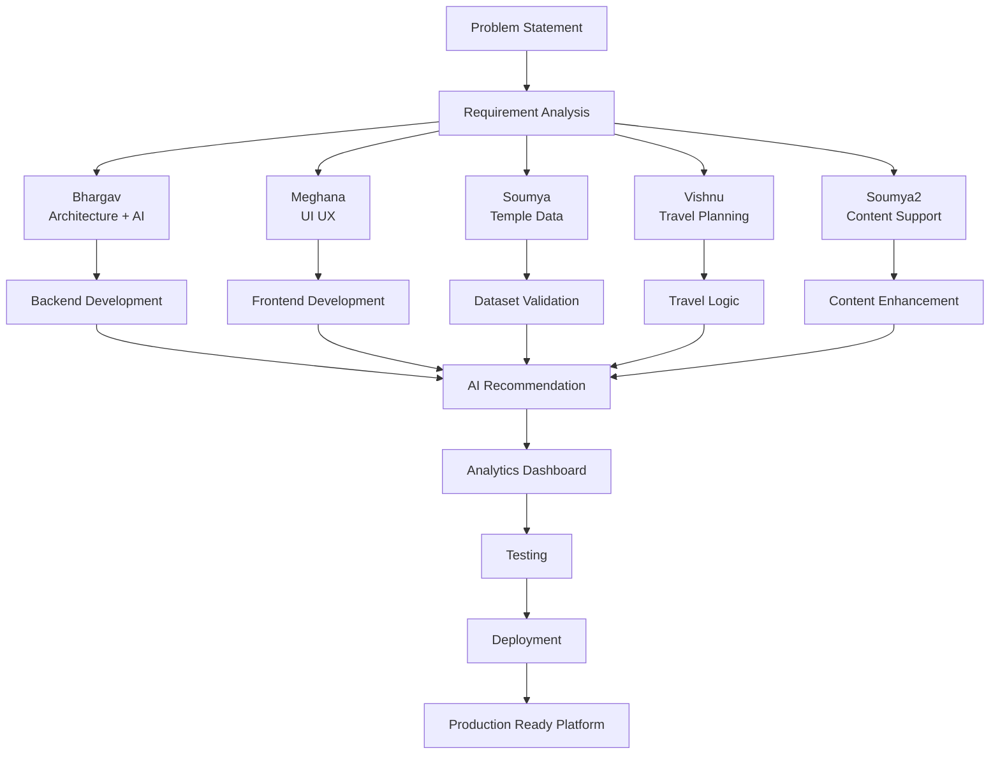

# Smart Pilgrim Companion — Team Contribution Documentation (Phase 0 → Phase 4)

## Project Title

Smart Pilgrim Companion:
Cloud-Based Spiritual Travel & Temple Assistance Platform Using AWS

---

# Project Timeline Summary

Project evolved through structured phases:

Phase 0 → Problem Understanding
Phase 1 → System Design & Planning
Phase 2 → Application Development
Phase 3 → AI + Analytics Integration
Phase 4 → Testing & Production Readiness

Current Status:
Completed up to Phase 4 ✅

---

# Team Contribution Summary

## Bhargav (AI • Backend • Architecture • Deployment)

Primary Ownership:
System Architecture & Technical Leadership

Contributions:

### Phase 0 — Problem Understanding

* Defined project vision
* Finalized Andhra Pradesh MVP scope
* Converted general idea into implementable architecture

### Phase 1 — Planning & System Design

* Designed overall application architecture
* Planned backend modular structure
* Designed APIs and service separation

### Phase 2 — Development

* Developed backend services
* Created planner engine
* Developed recommendation engine
* Integrated frontend and backend
* Managed repository structure
* Fixed deployment and integration issues

### Phase 3 — Intelligence Layer

* Implemented AI-assisted recommendation logic
* Added planner intelligence
* Integrated analytics tracking
* Added recommendation scoring

### Phase 4 — Validation

* Added testing strategy
* Implemented monitoring endpoints
* Improved production readiness
* Managed deployment verification

Final Responsibility:
Overall delivery, AI direction, deployment, integration, architecture.

---

## Meghana (Frontend • UI/UX • Experience Design)

Primary Ownership:
User Experience & Interface

Contributions:

### Phase 1

* Designed visual identity
* Defined user navigation flow

### Phase 2

* Built frontend pages
* Implemented responsive layouts
* Integrated themes
* Improved usability

### Phase 3

* Connected planner UI
* Supported analytics visualization

### Phase 4

* Refined responsiveness
* Improved production-ready UI behavior

Final Responsibility:
Frontend implementation and user experience.

---

## Soumya (Data Collection • Validation)

Primary Ownership:
Data Preparation

Contributions:

### Phase 0

* Gathered initial temple requirements

### Phase 1

* Organized datasets

### Phase 2

* Validated temple information
* Structured travel-related records

### Phase 3–4

* Supported content verification

Final Responsibility:
Data reliability and validation.

---

## Vishnu (Travel Scenarios • User Perspective)

Primary Ownership:
Journey Design

Contributions:

### Phase 1

* Defined traveler scenarios

### Phase 2

* Suggested planner journeys
* Improved travel sequence logic

### Phase 3

* Supported recommendation practicality

Final Responsibility:
Pilgrim experience enhancement.

---

## Soumya2 (Heritage • Awareness • Content)

Primary Ownership:
Content Support

Contributions:

### Phase 1–2

* Heritage support
* Temple contextual content
* Sustainability awareness

### Phase 3–4

* Supported content consistency

Final Responsibility:
Domain support and contextual enrichment.

---

# Mermaid Contribution Flow Diagram

---

# Phase Completion Status

Phase 0 → Completed ✅
Phase 1 → Completed ✅
Phase 2 → Completed ✅
Phase 3 → Completed ✅
Phase 4 → Completed ✅

Next:
Phase 5 → AWS Cloud Integration
