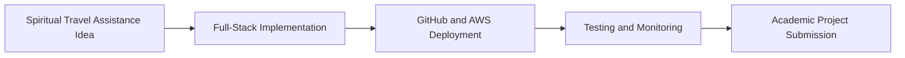

# Chapter 10: Conclusion

Smart Pilgrim Companion successfully demonstrates a cloud-based spiritual travel and temple assistance platform using a real full-stack implementation.

The project includes a React + Vite frontend, Flask backend, structured datasets, SQLAlchemy models, local SQLite development support, GitHub Pages frontend deployment, and AWS deployment evidence using EC2, Nginx, Gunicorn, RDS MySQL, IAM, and CloudWatch.

The application supports temple exploration, temple details, route and budget planning, nearby place guidance, schedule information, and recommendation output. The backend APIs provide structured JSON responses, while the frontend service layer normalizes API data for user-facing pages.

The academic and deployment objectives were achieved through:

- Complete repository-based implementation.
- Localhost validation.
- GitHub deployment evidence.
- AWS migration evidence.
- RDS configuration and monitoring evidence.
- Nginx and Gunicorn service evidence.
- Testing and final output screenshots.
- Team contribution mapping.

The project is suitable for final academic submission because it combines practical cloud deployment, application development, database design, monitoring, testing, and documentation.

## Conclusion Flow

