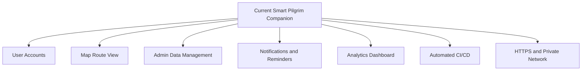

# Chapter 11: Future Scope

## 11.1 Overview

The current project provides temple exploration, travel planning, budget guidance, route support, and AWS deployment evidence. Future work can extend the platform into a larger pilgrim assistance ecosystem.

## 11.2 Future Enhancements

- Add user authentication for saved travel plans.
- Add role-based admin screens for managing temple data.
- Add live darshan timing integration if official APIs become available.
- Add map-based route visualization.
- Add multi-language support for regional pilgrims.
- Add offline PDF itinerary export.
- Add notification support for reminders and travel alerts.
- Add richer analytics dashboards for popular temples, budget choices, and planner usage.
- Add automated CI/CD for backend deployment.
- Add automated database migration tooling for RDS schema updates.

## 11.3 Cloud Enhancement Scope

- Add HTTPS with SSL certificate management.
- Add load balancer support if traffic increases.
- Add private subnet architecture for database isolation.
- Add automated CloudWatch alarms.
- Add backup and restore strategy for RDS.
- Add infrastructure-as-code templates for repeatable deployment.

## 11.4 Future Scope Diagram

