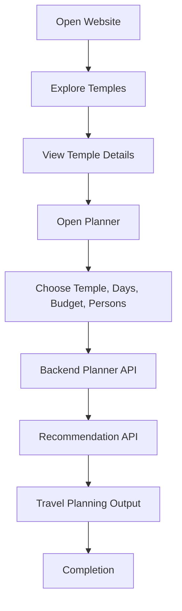

# Chapter 1: Introduction

## 1.1 Project Overview

Smart Pilgrim Companion is a web-based spiritual travel and temple assistance platform. It helps pilgrims explore selected temple destinations, review temple information, understand nearby places, compare travel routes, estimate budgets, and generate planning recommendations.

The repository implements the project as a full-stack application:

- Frontend: React + Vite in `frontend/`
- Backend: Flask REST API in `backend/`
- Data: CSV and JSON datasets in `data/`
- Database: schema, seed script, and local SQLite database in `database/`
- Deployment evidence: screenshots and audit files in `deployment/`
- Documentation: generated academic documentation in `docs/documentation/`

## 1.2 Temples Covered

The project dataset focuses on major pilgrimage destinations in Andhra Pradesh:

- Tirumala
- Srisailam
- Srikalahasti

These temples are represented through datasets for temple master data, travel routes, schedules, budgets, nearby places, metadata, and user scenarios.

## 1.3 Need for the Project

Pilgrims often need to collect information from multiple sources before planning a temple journey. They may need temple details, nearby places, travel mode options, estimated budgets, schedules, and best visit times. A single integrated platform reduces this fragmentation and improves planning clarity.

Smart Pilgrim Companion addresses this need by combining a user-friendly frontend with backend APIs and structured datasets. The project also demonstrates cloud migration by moving from localhost to GitHub deployment and AWS hosting.

## 1.4 Project Features

- Home page for project overview and quick navigation.
- Temples page for browsing spiritual destinations.
- Temple details page with temple-specific information.
- Explore page for destination discovery.
- Planner page for route, budget, nearby places, and timeline assistance.
- Recommendation endpoint that provides route and budget guidance.
- Backend APIs for temples, routes, planner, recommendation, analytics summary, performance, and health.
- Deployment proof using GitHub Pages and AWS infrastructure.

## 1.5 User Journey Diagram

## 1.6 Screenshot Evidence

[INSERT IMAGE:
github_deployment/HomePage.png
Caption: GitHub Pages home page showing the deployed frontend.]

[INSERT IMAGE:
github_deployment/Temples_page.png
Caption: Temples page showing available pilgrimage destinations.]

[INSERT IMAGE:
github_deployment/plannerpage.png
Caption: Planner page used for pilgrimage route and budget planning.]
