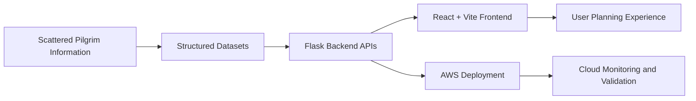

# Chapter 2: Problem Statement

## 2.1 Problem Statement

Pilgrims require reliable temple information, travel routes, schedules, nearby places, and budget planning support before beginning a spiritual journey. In many cases, these details are scattered across different websites, PDF references, personal notes, and local knowledge. This makes planning difficult, especially for users who want a simple interface that combines spiritual destination information with practical travel assistance.

The problem addressed by this project is the design and deployment of a cloud-based full-stack platform that provides temple exploration, route planning, budget estimation, and recommendation support using structured datasets and AWS deployment services.

## 2.2 Objectives

- Build a React + Vite frontend for temple exploration and travel planning.
- Build a Flask backend with JSON APIs for temples, planner, routes, recommendations, analytics, performance, and health.
- Use repository datasets as the source of truth for temple, route, budget, schedule, nearby place, metadata, and scenario information.
- Provide local development support through Vite and Flask.
- Deploy the frontend through GitHub Pages.
- Migrate the production architecture to AWS EC2, Nginx, Gunicorn, Flask, and AWS RDS MySQL.
- Use IAM for access control and CloudWatch for monitoring evidence.
- Prepare academic documentation with Mermaid diagrams and screenshot placeholders.

## 2.3 Existing Challenges

- Temple planning data is distributed across different sources.
- Users need route, schedule, budget, and nearby place information together.
- Static frontend-only information is not enough for planner and recommendation workflows.
- Production deployment requires separation of frontend hosting, backend service execution, reverse proxy configuration, and database connectivity.
- Cloud validation requires monitoring and evidence through AWS services.

## 2.4 Proposed Solution

The proposed system is a full-stack cloud-ready application:

- The frontend provides user-facing pages and calls backend APIs through `frontend/src/services/api.js`.
- The backend serves structured JSON responses through Flask routes.
- The data layer uses SQLAlchemy models mapped to temple, budget, route, schedule, and nearby place records.
- Local development uses SQLite through `database/smart_pilgrim.db`.
- AWS deployment uses environment-driven database configuration for AWS RDS MySQL.
- EC2 hosts the application backend with Gunicorn and Nginx.
- CloudWatch and AWS screenshots provide monitoring and validation evidence.

## 2.5 Scope

The project scope includes temple browsing, temple details, planner workflow, route and budget support, recommendation generation, API validation, deployment evidence, and academic documentation. The system is not a payment platform, booking platform, or live government darshan integration service.

## 2.6 Problem-to-Solution Flow

