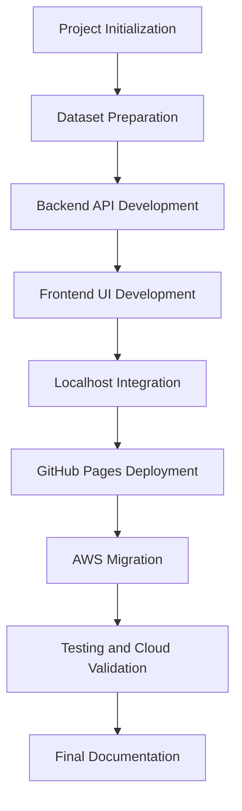
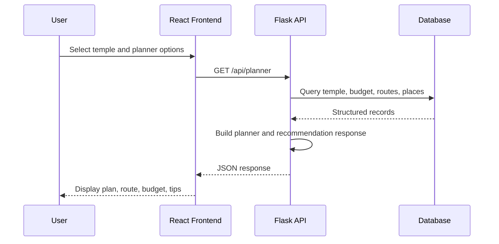

# Chapter 3: Methodology

## 3.1 Development Methodology

The project followed an implementation-first methodology. The team developed the frontend, backend, data layer, and deployment setup in stages. Each stage produced working outputs and evidence screenshots.

The repository status indicates feature freeze, allowing only deployment configuration, bug fixes, and production documentation after the checkpoint. This documentation follows that rule and does not modify application source code.

## 3.2 Project Workflow

## 3.3 Repository-Based Analysis

The documentation was prepared after analyzing:

- `README.md`
- `frontend/package.json`
- `frontend/src/App.jsx`
- `frontend/src/services/api.js`
- `frontend/src/services/templeService.js`
- `frontend/src/services/plannerService.js`
- `frontend/DEPLOYMENT_GUIDE.md`
- `backend/README.md`
- `backend/app.py`
- `backend/config.py`
- `backend/routes/temple_routes.py`
- `backend/services/planner_service.py`
- `backend/services/recommendation_engine.py`
- `database/schema.sql`
- `database/DATA_DICTIONARY.md`
- `deployment/aws/backend-audit.md`
- `deployment/aws/frontend-audit.md`
- `deployment/ProjectProofs/`

## 3.4 Data Methodology

The backend README states that existing CSV and JSON files are the source of truth. The data files include:

- `data/temples.csv`
- `data/travel_routes.csv`
- `data/budgets.csv`
- `data/schedules.csv`
- `data/temple_places.csv`
- `data/metadata.json`
- `data/user_scenarios.json`

The seed script `database/seed.py` creates and populates `database/smart_pilgrim.db` for local development. For AWS deployment, `backend/config.py` reads `DATABASE_URL` and supports RDS connection strings.

## 3.5 API Methodology

The backend exposes REST endpoints under `/api`. The frontend service layer calls these endpoints and normalizes the responses before rendering them in pages.

## 3.6 Deployment Methodology

Deployment was handled in three stages:

- Localhost validation using Vite and Flask.
- GitHub Pages frontend deployment using `gh-pages`.
- AWS migration using EC2, Nginx, Gunicorn, Flask, RDS MySQL, IAM, and CloudWatch.

## 3.7 Evidence Collection

Screenshots were collected under `deployment/ProjectProofs/` for development, GitHub deployment, AWS deployment, testing evidence, team contribution, and final output.

[INSERT IMAGE:
development/ProjectStructure.png
Caption: Repository structure evidence captured during development.]

[INSERT IMAGE:
development/frontend.png
Caption: Frontend development evidence.]

[INSERT IMAGE:
development/backend.png
Caption: Backend development evidence.]

[INSERT IMAGE:
development/data & database.png
Caption: Data and database development evidence.]
