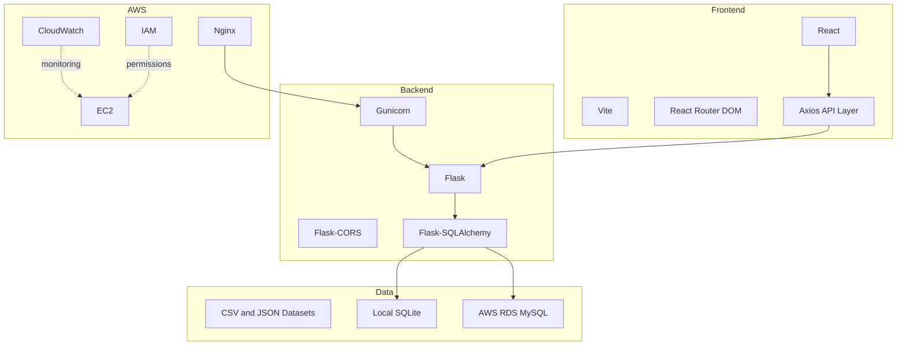

# Chapter 4: Technology Stack

## 4.1 Overview

The Smart Pilgrim Companion project uses a full-stack web architecture with a React frontend, Flask backend, SQLAlchemy data layer, and AWS deployment components.

## 4.2 Frontend Stack

| Technology | Actual Usage |
| --- | --- |
| React | User interface pages and reusable components |
| Vite | Frontend development server and production build |
| React Router DOM | Routes for Home, Temples, Temple Details, Planner, Explore, About |
| Axios | HTTP API requests |
| Tailwind CSS | Utility-based UI styling |
| gh-pages | GitHub Pages deployment |

Frontend files are located in `frontend/`. The main route configuration is in `frontend/src/App.jsx`.

## 4.3 Backend Stack

| Technology | Actual Usage |
| --- | --- |
| Python | Backend language |
| Flask | REST API framework |
| Flask-CORS | Cross-origin frontend/backend API access |
| Flask-SQLAlchemy | ORM layer |
| pandas | Dataset handling support |
| Gunicorn | Production WSGI server for AWS deployment |
| python-dotenv | Environment variable loading |

Backend files are located in `backend/`. The application entry point is `backend/app.py`.

## 4.4 Database Stack

| Environment | Database |
| --- | --- |
| Local development | SQLite database at `database/smart_pilgrim.db` |
| AWS deployment target | AWS RDS MySQL using `DATABASE_URL` |

The schema contains tables for temples, travel routes, budgets, schedules, and temple places.

## 4.5 AWS Stack

| AWS Component | Project Usage |
| --- | --- |
| EC2 | Hosts backend/application deployment |
| Nginx | Reverse proxy for backend routing |
| Gunicorn | Runs Flask application as production service |
| RDS MySQL | Production relational database target |
| IAM | Access control and permission management |
| CloudWatch | Monitoring evidence for EC2 and application behavior |
| S3 | Evidence includes frontend zip storage screenshot |

## 4.6 Tooling and Configuration

- `frontend/package.json` defines `dev`, `build`, `preview`, `predeploy`, and `deploy`.
- `frontend/src/services/api.js` reads `VITE_API_URL` and falls back to localhost.
- `backend/config.py` reads `DATABASE_URL` and `SECRET_KEY`.
- `backend/requirements.txt` includes Flask, Flask-CORS, Flask-SQLAlchemy, pandas, and gunicorn.

## 4.7 Stack Diagram

