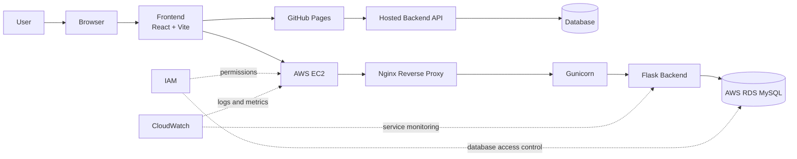
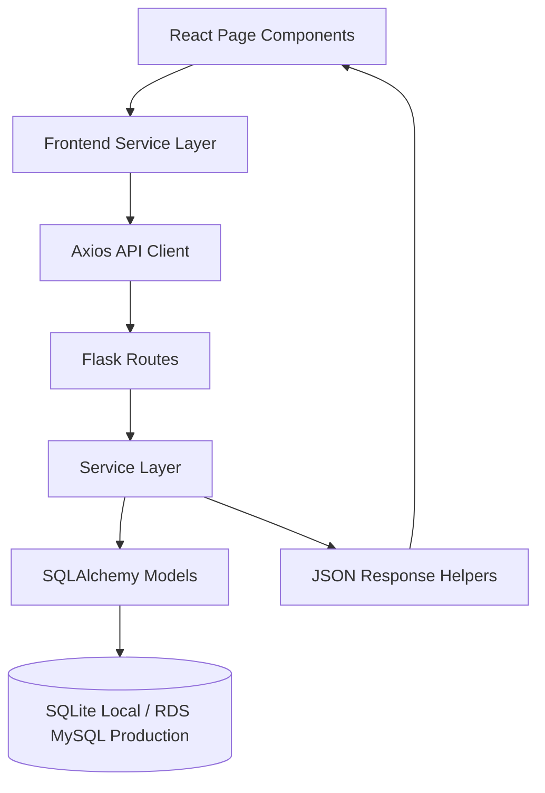
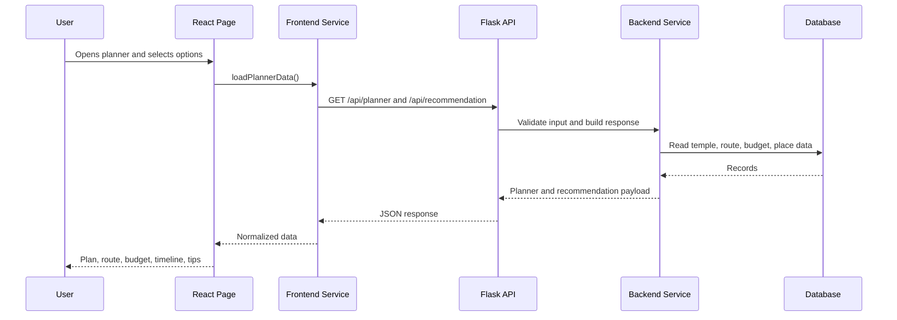
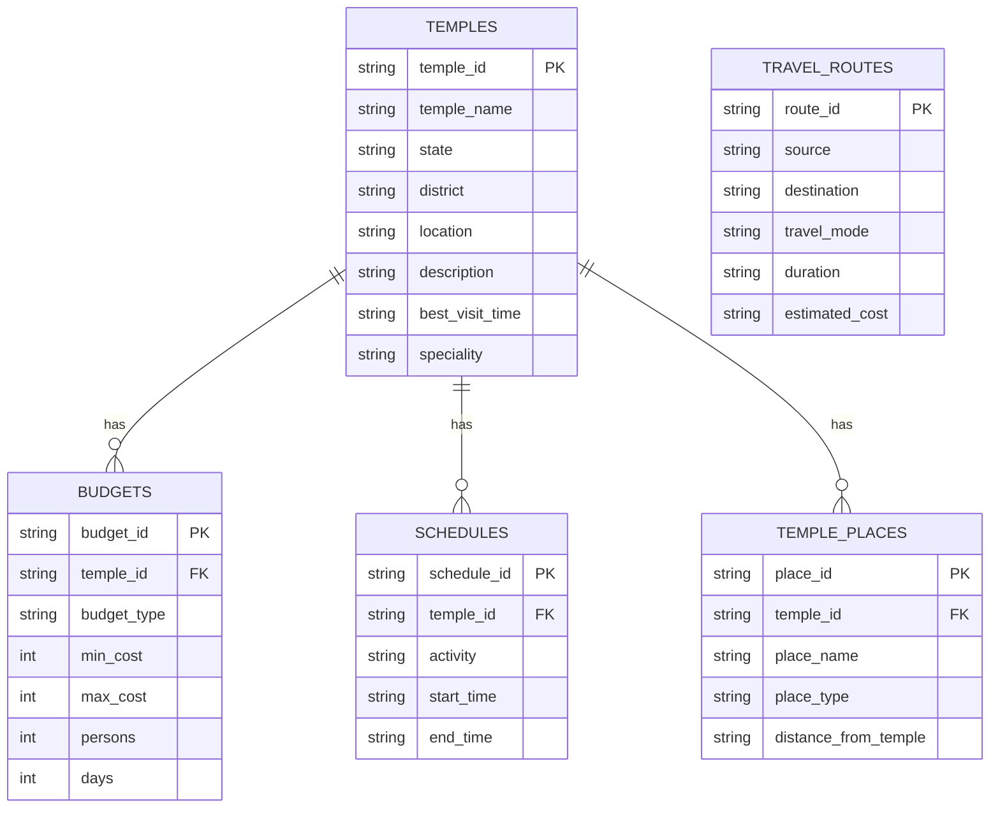
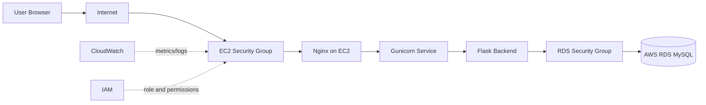
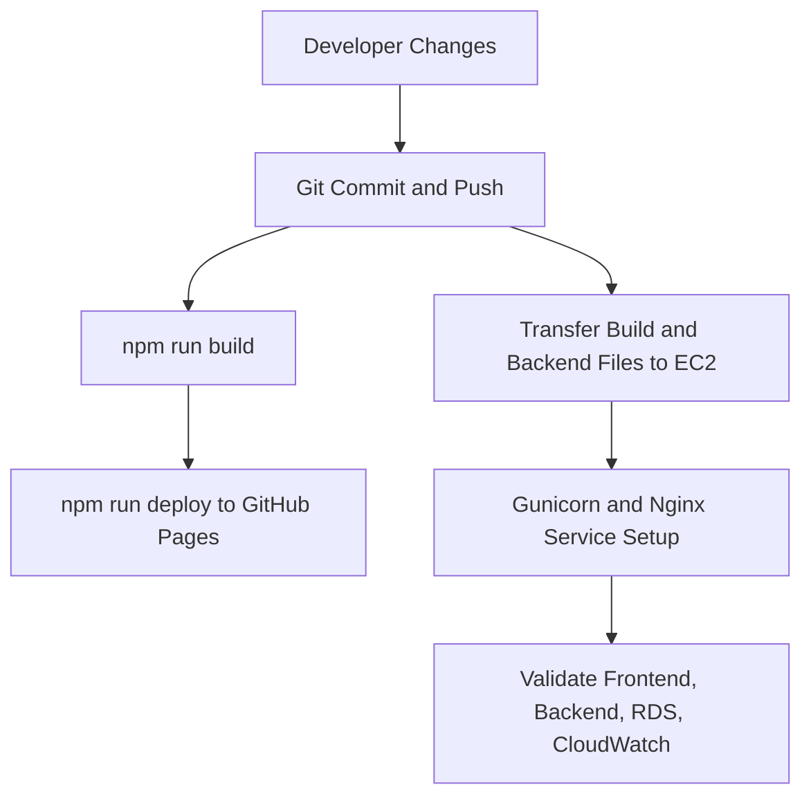

# Chapter 5: System Design

## 5.1 System Architecture

Smart Pilgrim Companion follows a client-server architecture. The frontend is built using React + Vite and communicates with the Flask backend through REST APIs. The backend uses SQLAlchemy models and database configuration that supports local SQLite and AWS RDS MySQL.

## 5.2 Frontend Design

The frontend is organized into pages, components, services, data, styles, and static assets.

Important frontend routes from `frontend/src/App.jsx`:

- `/` -> Home page
- `/temples` -> Temples listing
- `/temples/:templeId` -> Temple details
- `/planner` -> Travel planner
- `/explore` -> Explore page
- `/about` -> About page

The API base configuration is handled in `frontend/src/services/api.js`. It reads `VITE_API_URL` and falls back to `http://localhost:5000`.

## 5.3 Backend Design

The backend is organized into:

- `backend/app.py` - Flask app factory and health route.
- `backend/config.py` - database and environment configuration.
- `backend/routes/temple_routes.py` - API endpoints.
- `backend/services/` - business logic for temples, search, planner, recommendations, analytics.
- `backend/models/` - SQLAlchemy models.
- `backend/utils/` - response and validation helpers.

## 5.4 Module Flow

## 5.5 Request Lifecycle

## 5.6 Database Relation Diagram

The local schema is defined in `database/schema.sql`. The same logical model supports migration to AWS RDS MySQL.

## 5.7 AWS Network Flow

## 5.8 CI/CD Flow

The repository uses GitHub for source control and `gh-pages` for frontend deployment. The AWS migration flow is supported by manual build, upload, service configuration, and deployment validation evidence.

## 5.9 Design Evidence

[INSERT IMAGE:
development/ProjectStructure.png
Caption: Project structure evidence used for system design verification.]

[INSERT IMAGE:
aws_deployment/rds_configuration.png
Caption: AWS RDS configuration evidence for production database setup.]

[INSERT IMAGE:
aws_deployment/security_groups_EC2.png
Caption: EC2 security group evidence for AWS network configuration.]
