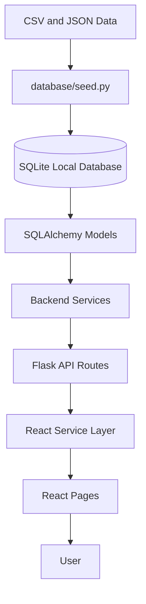

# Chapter 6: Implementation

## 6.1 Repository Implementation

The actual repository is divided into frontend, backend, database, data, deployment, and documentation areas.

```text
smart-pilgrim-companion/
  backend/
  data/
  database/
  deployment/
  docs/
  frontend/
  README.md
  RELEASE_NOTES.md
```

## 6.2 Frontend Implementation

The frontend is implemented with React + Vite. The important files include:

- `frontend/src/main.jsx`
- `frontend/src/App.jsx`
- `frontend/src/pages/HomePage.jsx`
- `frontend/src/pages/TemplesPage.jsx`
- `frontend/src/pages/TempleDetailsPage.jsx`
- `frontend/src/pages/TravelPlannerPage.jsx`
- `frontend/src/pages/ExplorePage.jsx`
- `frontend/src/pages/AboutPage.jsx`
- `frontend/src/components/`
- `frontend/src/services/`
- `frontend/src/data/`

The frontend service layer uses `axios` and reads the backend base URL from `VITE_API_URL`.

## 6.3 Frontend API Integration

`frontend/src/services/api.js` defines:

- `DEFAULT_API_URL = http://localhost:5000`
- `API_BASE_URL = <VITE_API_URL or localhost>/api`
- request interceptors for loading state
- response error normalization
- GET request de-duplication
- query string helper

The application service files use this API client:

- `templeService.js` loads temples, temple details, and search results.
- `plannerService.js` loads planner and recommendation data.
- `routeService.js` loads route data.
- `budgetService.js` loads budget information.

## 6.4 Backend Implementation

The backend is implemented with Flask. `backend/app.py` creates the Flask app, loads environment variables, applies configuration, initializes SQLAlchemy, enables CORS, registers the temple blueprint under `/api`, and provides a root health response.

The backend route file `backend/routes/temple_routes.py` includes:

- `GET /api/health`
- `GET /api/temples`
- `GET /api/temples/<identifier>`
- `GET /api/routes`
- `GET /api/planner`
- `GET /api/recommendation`
- `GET /api/performance`
- `GET /api/analytics/summary`

## 6.5 Planner Implementation

`backend/services/planner_service.py` resolves the selected temple, normalizes budget type, selects budgets and routes, builds itinerary steps, increments analytics metrics, and returns a structured planning payload.

Planner output includes:

- temple details
- selected route
- budget options
- route options
- timeline
- nearby places
- smart tips
- risk notes
- estimated budget
- AI-style recommendation node

## 6.6 Recommendation Implementation

`backend/services/recommendation_engine.py` builds route and budget recommendations using the available database records. It calculates route scoring using:

- budget fit
- travel time score
- temple priority score
- nearby places score

The response includes recommended route, estimated budget, best visit time, smart tip, confidence score, route details, and budget details.

## 6.7 Database Implementation

The database schema includes:

- `temples`
- `travel_routes`
- `budgets`
- `schedules`
- `temple_places`

The local database is generated as `database/smart_pilgrim.db` using `database/seed.py`. The project data is stored under `data/` using CSV and JSON files.

## 6.8 API Response Structure

The backend returns JSON responses in a consistent pattern:

```json
{
  "status": "success",
  "message": "temples fetched",
  "data": []
}
```

Validation errors return structured error responses with useful messages, especially in planner validation for missing temple, invalid days, and invalid budget selection.

## 6.9 Implementation Flow Diagram



## 6.10 UI Evidence

[INSERT IMAGE:
github_deployment/explorepage.png
Caption: Explore page in GitHub deployment.]

[INSERT IMAGE:
github_deployment/aboutpage.png
Caption: About page in GitHub deployment.]

[INSERT IMAGE:
aws_deployment/explore_page.png
Caption: Explore page after AWS deployment.]

[INSERT IMAGE:
aws_deployment/planner_page.png
Caption: Planner page after AWS deployment.]
