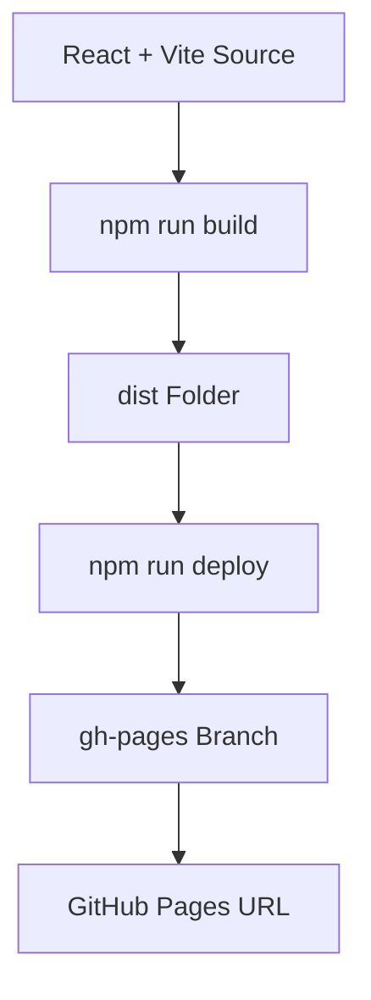
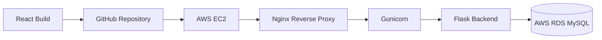
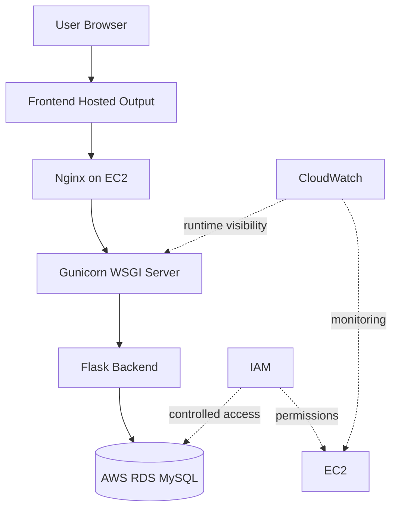
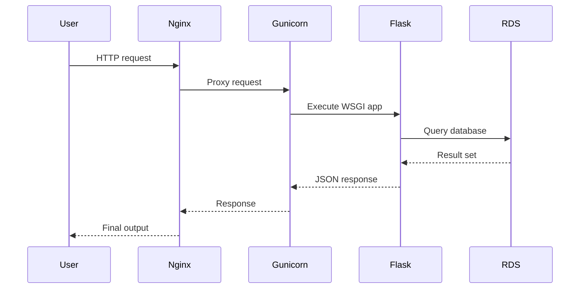

# Chapter 7: AWS Deployment

## 7.1 Deployment Overview

The project deployment evolved from local development to GitHub frontend hosting and then to AWS infrastructure. The final expected AWS architecture uses EC2, Nginx, Gunicorn, Flask, AWS RDS MySQL, IAM, and CloudWatch.

## 7.2 Localhost Deployment

During development, the frontend runs through Vite and the backend runs through Flask.

Frontend:

```bash
cd frontend
npm install
npm run dev
```

Backend:

```bash
python -m venv venv
venv\Scripts\activate
pip install -r backend\requirements.txt
python database\seed.py
python backend\app.py
```

The frontend service configuration falls back to:

```text
http://localhost:5000/api
```

Localhost evidence:

[INSERT IMAGE:
localhost/Sample_UI_UX_Version2_Pics/HomePage.png
Caption: Localhost UI validation home page from sample UI/UX version 2.]

[INSERT IMAGE:
localhost/Sample_UI_UX_Version1_Pics/WhatsApp Image 2026-06-23 at 10.27.16 PM.jpeg
Caption: Localhost sample UI/UX version 1 evidence.]

## 7.3 GitHub Deployment

The frontend supports GitHub Pages deployment using `gh-pages`.

Important values from `frontend/package.json`:

- `homepage`: `https://APSSDC-AWS-VVIT.github.io/smart-pilgrim-companion`
- `build`: `vite build`
- `predeploy`: `npm run build`
- `deploy`: `gh-pages -d dist`

GitHub deployment flow:



## 7.4 AWS Migration Flow

The AWS migration follows this path:



## 7.5 AWS Runtime Architecture



## 7.6 Backend Environment Configuration

`backend/config.py` reads the production database connection through:

```text
DATABASE_URL
```

If `DATABASE_URL` is not supplied, the backend falls back to local SQLite:

```text
database/smart_pilgrim.db
```

For AWS RDS MySQL deployment, `DATABASE_URL` should point to the RDS MySQL database. The configuration contains handling for RDS host strings and appends the `smart_pilgrim` database name when needed.

## 7.7 Nginx and Gunicorn Role

Nginx receives HTTP traffic and forwards backend requests to Gunicorn. Gunicorn runs the Flask application as a production WSGI service. This separates external request handling from Python application execution.



## 7.8 Cloud Monitoring

CloudWatch is used to validate cloud monitoring. Evidence includes EC2 monitoring screenshots and service status screenshots for Gunicorn and Nginx.

## 7.9 AWS Deployment Evidence

[INSERT IMAGE:
aws_deployment/homepage.png
Caption: AWS deployment home page.]

[INSERT IMAGE:
aws_deployment/home_page_dark_2.png
Caption: AWS deployed home page in dark mode.]

[INSERT IMAGE:
aws_deployment/temples_page.png
Caption: AWS deployment temples page.]

[INSERT IMAGE:
aws_deployment/planner_page.png
Caption: AWS deployment planner page.]

[INSERT IMAGE:
aws_deployment/about_page.png
Caption: AWS deployment about page.]

[INSERT IMAGE:
aws_deployment/nginx_server_status.png
Caption: Nginx service status evidence on EC2.]

[INSERT IMAGE:
aws_deployment/gunircorn_status.png
Caption: Gunicorn service status evidence on EC2.]

[INSERT IMAGE:
aws_deployment/ec2_monitoring.png
Caption: EC2 monitoring evidence in AWS.]

[INSERT IMAGE:
aws_deployment/rds_configuration.png
Caption: AWS RDS MySQL configuration evidence.]

[INSERT IMAGE:
aws_deployment/rds_monitoring.png
Caption: AWS RDS monitoring evidence.]

[INSERT IMAGE:
aws_deployment/rds_security_groups.png
Caption: RDS security group evidence.]

[INSERT IMAGE:
aws_deployment/security_groups_EC2.png
Caption: EC2 security group evidence.]

[INSERT IMAGE:
aws_deployment/s3_frontend_ZipFile.png
Caption: S3 frontend zip file evidence.]
