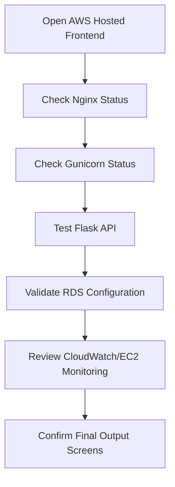
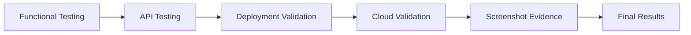

# Chapter 8: Testing and Results

## 8.1 Testing Overview

Testing focused on frontend functionality, backend API behavior, deployment validation, cloud resource validation, and final output verification.

## 8.2 Functional Testing

Functional testing validates the main user workflows:

- Open the home page.
- Navigate to temples.
- Open temple details.
- Explore destination information.
- Use the planner page.
- Trigger planner and recommendation API calls.
- View route, budget, timeline, nearby places, tips, and risk notes.

## 8.3 API Testing

Backend endpoints verified from the repository include:

- `GET /api/health`
- `GET /api/temples`
- `GET /api/temples/<identifier>`
- `GET /api/routes`
- `GET /api/planner`
- `GET /api/recommendation`
- `GET /api/performance`
- `GET /api/analytics/summary`

Validation behavior includes:

- Missing temple selection returns an error.
- Invalid days values return an error.
- Invalid budget selection returns an error.
- Unknown temple returns a not found response.

## 8.4 Deployment Validation

Deployment validation covered:

- Frontend build generation through `npm run build`.
- GitHub Pages deployment through `npm run deploy`.
- AWS frontend page access.
- EC2 service accessibility.
- Nginx status validation.
- Gunicorn status validation.
- RDS configuration and monitoring evidence.
- CloudWatch/EC2 monitoring evidence.

## 8.5 Cloud Validation

Cloud validation confirms the final AWS migration path:

## 8.6 Testing Flow

## 8.7 Results

The project produced a working frontend, backend API layer, planner workflow, recommendation response, deployment evidence, monitoring evidence, and final output screenshots. The implementation demonstrates the expected academic project objectives:

- Full-stack implementation completed.
- Localhost development workflow validated.
- GitHub Pages frontend deployment evidenced.
- AWS EC2 deployment evidenced.
- Nginx and Gunicorn service status evidenced.
- RDS configuration and monitoring evidenced.
- Team contribution and final output evidence collected.

## 8.8 Testing Evidence Screenshots

[INSERT IMAGE:
testing_evidence/output1.png
Caption: Testing evidence output 1.]

[INSERT IMAGE:
testing_evidence/output2.png
Caption: Testing evidence output 2.]

[INSERT IMAGE:
testing_evidence/output3.png
Caption: Testing evidence output 3.]

[INSERT IMAGE:
testing_evidence/output4.png
Caption: Testing evidence output 4.]

[INSERT IMAGE:
testing_evidence/output5.png
Caption: Testing evidence output 5.]

[INSERT IMAGE:
testing_evidence/output6.png
Caption: Testing evidence output 6.]

[INSERT IMAGE:
testing_evidence/output7.png
Caption: Testing evidence output 7.]

[INSERT IMAGE:
testing_evidence/output8.png
Caption: Testing evidence output 8.]

[INSERT IMAGE:
testing_evidence/output9.png
Caption: Testing evidence output 9.]

## 8.9 Final Output Screenshots

[INSERT IMAGE:
final_output/output1.png
Caption: Final output screen 1.]

[INSERT IMAGE:
final_output/output2.png
Caption: Final output screen 2.]

[INSERT IMAGE:
final_output/output3.png
Caption: Final output screen 3.]

[INSERT IMAGE:
final_output/output4.png
Caption: Final output screen 4.]

[INSERT IMAGE:
final_output/output5.png
Caption: Final output screen 5.]

[INSERT IMAGE:
final_output/output6.png
Caption: Final output screen 6.]

[INSERT IMAGE:
final_output/output7.png
Caption: Final output screen 7.]

[INSERT IMAGE:
final_output/output8.png
Caption: Final output screen 8.]

[INSERT IMAGE:
final_output/output9.png
Caption: Final output screen 9.]
