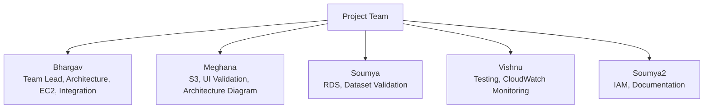

# Chapter 9: Team Contributions

## 9.1 Team Contribution Overview

The Smart Pilgrim Companion project was completed through coordinated work across architecture, frontend validation, backend integration, database deployment, cloud monitoring, IAM, and documentation.

## 9.2 Contribution Mapping

| Team Member | Contribution |
| --- | --- |
| Bhargav | Team Lead, Architecture, EC2 Deployment, Integration |
| Meghana | S3, UI Validation, Architecture Diagram |
| Soumya | RDS, Dataset Validation |
| Vishnu | Testing, CloudWatch Monitoring |
| Soumya2 | IAM, Documentation |

## 9.3 Responsibility Flow

## 9.4 Collaboration Evidence

[INSERT IMAGE:
team_contribution/GithubOrganizationHompage.png
Caption: GitHub organization homepage evidence.]

[INSERT IMAGE:
team_contribution/GithubRepo.png
Caption: GitHub repository evidence.]

[INSERT IMAGE:
team_contribution/Github_Branches.png
Caption: GitHub branch collaboration evidence.]

[INSERT IMAGE:
team_contribution/Contribution_Graph.png
Caption: GitHub contribution graph evidence.]

[INSERT IMAGE:
team_contribution/TeamMembers.png
Caption: Team members evidence.]
