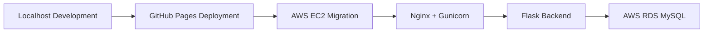
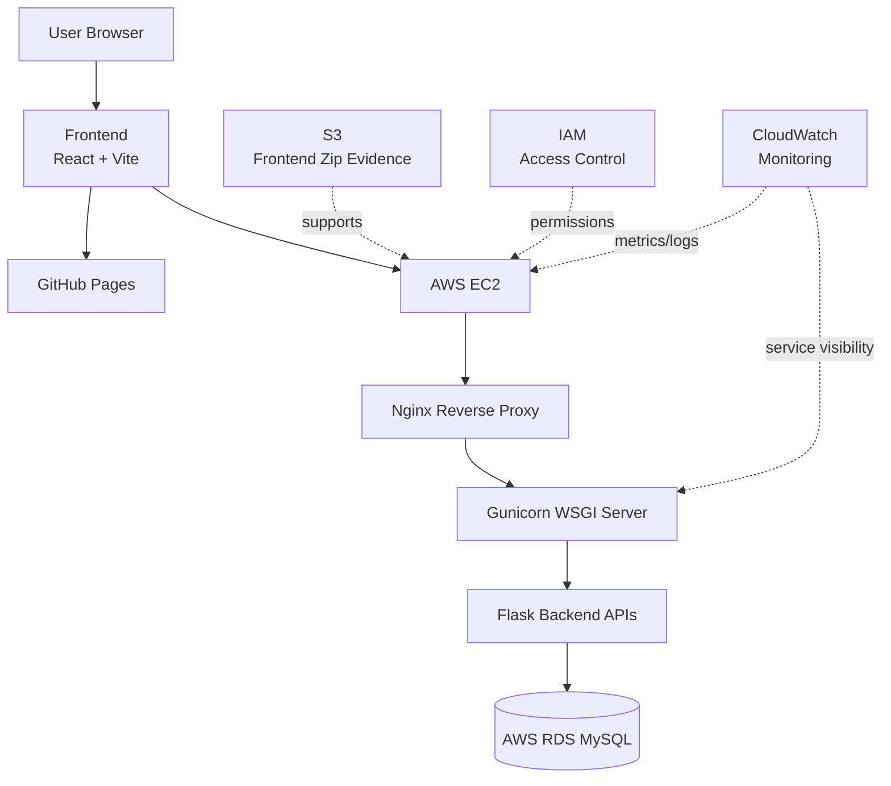
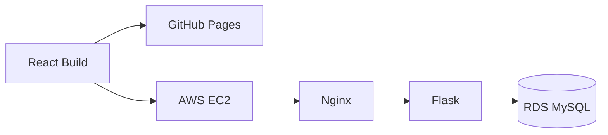
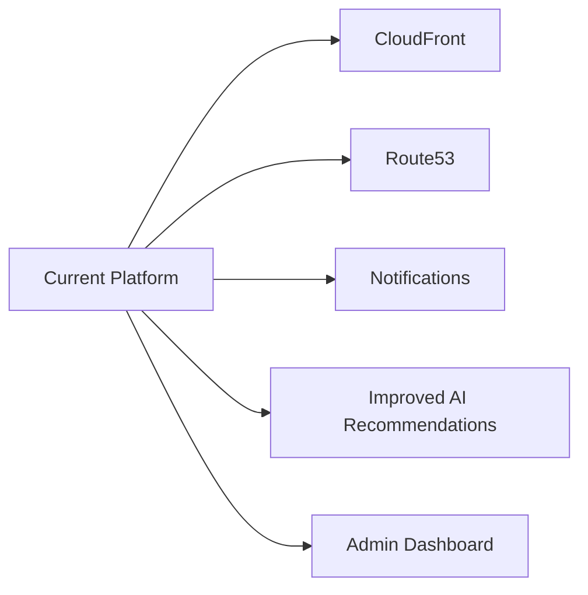

# PPT Content

Project: **Smart Pilgrim Companion: Cloud-Based Spiritual Travel & Temple Assistance Platform Using AWS**

Format: 16:9 widescreen.

Design theme: light background, premium minimal academic style, warm temple identity, cloud architecture accents.

---

## Slide 1: Cover

### Objective

Introduce the project identity, team, institution, and cloud deployment context.

### Layout

Centered hero layout.

- Large Smart Pilgrim Companion logo in the middle.
- Project title below or beside the logo.
- Team details in a clean lower band.
- VVIT logo placeholder in top-right.

### Content

**Smart Pilgrim Companion**

Cloud-Based Spiritual Travel & Temple Assistance Platform Using AWS

Team Leader: **Bhargav Sai Viswanath**

Team Members:

- Bhargav
- Meghana
- Soumya
- Vishnu
- Soumya2

Department: CSE / AI-ML Department

Location: Nambur, Guntur

Academic Year: 2025-2026

### Image Placeholder

[Insert VVIT Logo]

[Insert SmartPiligrimCompanionLogo.png]

Path:

`C:/Users/DELL/Documents/bhargav-dev/smart-pilgrim-companion/frontend/public/assets/images/SmartPiligrimCompanionLogo.png`

### Animation Suggestion

Logo fade in, then title and team details appear softly.

### Speaker Notes

Good morning respected faculty and panel members. Our project is Smart Pilgrim Companion, a cloud-based spiritual travel and temple assistance platform using AWS. It combines a React frontend, Flask backend, database-backed planning APIs, and AWS deployment evidence.

### Viva Talking Points

- Full-stack project.
- Actual repository implementation.
- AWS deployment focus.
- Built for temple discovery and travel planning.

---

## Slide 2: Problem Statement + Motivation

### Objective

Explain the practical difficulty faced by pilgrims and why the platform is useful.

### Layout

Left side: short problem headline and 4 pain-point cards.

Right side: journey illustration placeholder.

### Content

**Pilgrimage planning is fragmented.**

Key problems:

- Temple information is scattered.
- Travel planning requires multiple sources.
- Budget and schedule details are hard to compare.
- Users need simple guidance before starting the journey.

Motivation:

Create one platform that combines temple discovery, trip planning, travel route guidance, and cloud availability.

### Image Placeholder

[Insert Journey Illustration]

Suggested evidence:

`C:/Users/DELL/Documents/ProjectProofs/final_output/output1.png`

### Animation Suggestion

Reveal each problem card one by one.

### Speaker Notes

The problem is not only about showing temple names. A pilgrim needs routes, budgets, schedules, nearby places, and a plan. Without a combined system, users must check multiple sources manually. Our project reduces that effort through one web platform.

### Viva Talking Points

- Real user pain point.
- Information fragmentation.
- Planning and travel complexity.
- Motivation for integrated platform.

---

## Slide 3: Solution Overview

### Objective

Summarize what the application provides and show the deployment journey from local development to cloud.

### Layout

Top: one-line solution statement.

Middle: journey flow diagram.

Bottom: 5 compact feature chips.

### Content

**A single cloud-ready platform for temple discovery and pilgrim travel planning.**

Features:

- Temple discovery
- Temple details
- Trip planner
- Route and budget support
- Recommendation output
- Responsive UI

### Mermaid Diagram

### Image Placeholder

[Insert Solution Screenshot]

Suggested evidence:

`C:/Users/DELL/Documents/ProjectProofs/github_deployment/HomePage.png`

### Animation Suggestion

Reveal flow from left to right.

### Speaker Notes

The solution begins as a React + Vite frontend and Flask backend on localhost. The frontend is deployed through GitHub Pages, and the AWS deployment uses EC2, Nginx, Gunicorn, Flask, and RDS MySQL. This shows both application development and cloud migration.

### Viva Talking Points

- React + Vite frontend.
- Flask backend.
- GitHub Pages public hosting.
- AWS migration path.

---

## Slide 4: System Architecture

### Objective

Present the final architecture clearly and confidently.

### Layout

Premium architecture diagram occupying most of the slide.

Small side legend for supporting AWS services.

### Content

Architecture layers:

- Frontend: React + Vite
- Reverse proxy: Nginx
- Backend runtime: Gunicorn + Flask
- Database: AWS RDS MySQL
- Supporting cloud services: S3, IAM, CloudWatch

### Mermaid Diagram

### Image Placeholder

[Insert Architecture Diagram Render]

Suggested supporting screenshots:

`C:/Users/DELL/Documents/ProjectProofs/aws_deployment/nginx_server_status.png`

`C:/Users/DELL/Documents/ProjectProofs/aws_deployment/rds_configuration.png`

### Animation Suggestion

Reveal by layers: frontend, EC2, Nginx/Gunicorn/Flask, RDS, side services.

### Speaker Notes

The user interacts with the React frontend. In AWS deployment, requests are handled by EC2, routed through Nginx, served by Gunicorn, executed by Flask APIs, and persisted using AWS RDS MySQL. IAM manages permissions and CloudWatch provides monitoring evidence.

### Viva Talking Points

- Nginx separates public traffic from Flask.
- Gunicorn is the production WSGI server.
- RDS MySQL is the production database target.
- CloudWatch proves monitoring.

---

## Slide 5: Development Journey

### Objective

Show how the project progressed from planning to documentation.

### Layout

Horizontal timeline with 5 phases.

Screenshots in a lower evidence strip.

### Content

**From idea to deployed cloud project**

Phase 1: Planning

Phase 2: Development

Phase 3: Deployment

Phase 4: Testing

Phase 5: Documentation

### Image Placeholder

`C:/Users/DELL/Documents/ProjectProofs/development/ProjectStructure.png`

`C:/Users/DELL/Documents/ProjectProofs/development/frontend.png`

`C:/Users/DELL/Documents/ProjectProofs/development/backend.png`

`C:/Users/DELL/Documents/ProjectProofs/team_contribution/Github_Branches.png`

### Animation Suggestion

Timeline reveals phase by phase.

### Speaker Notes

The project journey started with planning and dataset preparation, then moved into frontend and backend development. After local integration, we deployed the frontend, migrated the backend architecture to AWS, validated services, collected evidence, and prepared final documentation.

### Viva Talking Points

- Clear staged development.
- Repository structure evidence.
- Frontend and backend built separately then integrated.
- Documentation created after implementation.

---

## Slide 6: Key Features

### Objective

Present user-facing features using concise cards and real app screenshots.

### Layout

Six feature cards around one large final output screenshot.

### Content

Key features:

- Temple Search
- Trip Planner
- Recommendations
- Explore
- About
- Responsive UI

### Image Placeholder

`C:/Users/DELL/Documents/ProjectProofs/final_output/output1.png`

`C:/Users/DELL/Documents/ProjectProofs/final_output/output4.png`

`C:/Users/DELL/Documents/ProjectProofs/final_output/output8.png`

### Animation Suggestion

Feature cards appear in a gentle cascade.

### Speaker Notes

The main product features are temple browsing, temple details, trip planning, recommendation support, explore pages, and responsive UI. The planner connects frontend inputs with backend APIs to return route, budget, nearby place, and smart tip information.

### Viva Talking Points

- Actual frontend pages exist in React Router.
- Planner uses backend APIs.
- Recommendation logic uses route and budget data.
- UI supports light and dark visual states.

---

## Slide 7: Deployment Showcase

### Objective

Compare GitHub deployment and AWS deployment visually.

### Layout

Split screen:

- Left: GitHub Pages deployment.
- Right: AWS deployment.

Bottom: dual deployment architecture strip.

### Content

**Dual Deployment Architecture**

GitHub Deployment:

- GitHub Pages
- React build
- Public frontend output

AWS Deployment:

- EC2
- Nginx
- Gunicorn
- Flask
- RDS
- CloudWatch

### Image Placeholder

Left:

`C:/Users/DELL/Documents/ProjectProofs/github_deployment/HomePage.png`

`C:/Users/DELL/Documents/ProjectProofs/github_deployment/Temples_page.png`

Right:

`C:/Users/DELL/Documents/ProjectProofs/aws_deployment/homepage.png`

`C:/Users/DELL/Documents/ProjectProofs/aws_deployment/temples_page.png`

### Mermaid Diagram

### Animation Suggestion

Reveal GitHub side first, then AWS side, then architecture strip.

### Speaker Notes

We maintained a GitHub Pages deployment for frontend hosting evidence and completed an AWS deployment path using EC2, Nginx, Gunicorn, Flask, and RDS. This slide proves that the project is not only developed locally but also validated through deployment evidence.

### Viva Talking Points

- GitHub Pages for frontend.
- AWS for backend/cloud infrastructure.
- Nginx and Gunicorn statuses captured.
- RDS and monitoring captured.

---

## Slide 8: Team Contributions

### Objective

Show balanced and transparent contribution mapping.

### Layout

Five contribution cards with role tags.

Evidence screenshot row at bottom.

### Content

Team contributions:

- Bhargav: Architecture, Integration, Deployment
- Meghana: Frontend, UI Validation, Assets
- Soumya: Dataset, RDS
- Vishnu: Testing, Monitoring
- Soumya2: IAM, Documentation

### Image Placeholder

`C:/Users/DELL/Documents/ProjectProofs/team_contribution/TeamMembers.png`

`C:/Users/DELL/Documents/ProjectProofs/team_contribution/Contribution_Graph.png`

`C:/Users/DELL/Documents/ProjectProofs/team_contribution/GithubRepo.png`

### Animation Suggestion

Contribution cards fade in together; evidence row appears last.

### Speaker Notes

The work was divided across architecture, deployment, frontend validation, dataset and RDS support, testing, monitoring, IAM, and documentation. This division helped us complete both the application and the AWS evidence required for final submission.

### Viva Talking Points

- Bhargav led architecture and EC2 integration.
- Meghana handled UI validation and assets.
- Soumya supported dataset and RDS validation.
- Vishnu handled testing and CloudWatch monitoring.
- Soumya2 handled IAM and documentation.

---

## Slide 9: Results + Metrics

### Objective

Summarize the final working status and evidence.

### Layout

Top: three result metrics.

Middle: evidence screenshot grid.

Bottom: result statement.

### Content

Results:

- Working application completed.
- GitHub and AWS deployment evidence collected.
- Testing and cloud validation completed.

Evidence:

- Frontend pages
- Backend API validation
- Nginx/Gunicorn service status
- RDS monitoring
- Final output screens

### Image Placeholder

`C:/Users/DELL/Documents/ProjectProofs/testing_evidence/output1.png`

`C:/Users/DELL/Documents/ProjectProofs/testing_evidence/output8.png`

`C:/Users/DELL/Documents/ProjectProofs/aws_deployment/ec2_monitoring.png`

`C:/Users/DELL/Documents/ProjectProofs/aws_deployment/rds_monitoring.png`

`C:/Users/DELL/Documents/ProjectProofs/final_output/output9.png`

### Animation Suggestion

Reveal metrics first, then evidence grid.

### Speaker Notes

The results show a working full-stack application with deployment evidence. We captured testing outputs, final application screens, EC2 monitoring, RDS monitoring, and service statuses for Nginx and Gunicorn.

### Viva Talking Points

- Testing evidence folder has outputs 1-9.
- Final output folder has screens 1-9.
- AWS monitoring screenshots prove cloud validation.
- Deployment was verified beyond local development.

---

## Slide 10: Learnings + Future Scope

### Objective

Close the technical story with learning outcomes and realistic next steps.

### Layout

Two columns:

- Learnings
- Future Scope

Small architecture icon strip at bottom.

### Content

Learnings:

- React frontend architecture
- Flask API development
- Dataset-driven backend design
- EC2 deployment workflow
- Nginx and Gunicorn setup
- RDS connectivity and monitoring

Future Scope:

- CloudFront
- Route53
- Notifications
- AI recommendations
- HTTPS and domain setup
- Admin data management

### Image Placeholder

`C:/Users/DELL/Documents/ProjectProofs/aws_deployment/rds_configuration.png`

`C:/Users/DELL/Documents/ProjectProofs/aws_deployment/s3_frontend_ZipFile.png`

### Mermaid Diagram

### Animation Suggestion

Reveal learnings, then future scope.

### Speaker Notes

The project helped us understand how a frontend, backend, database, and cloud deployment work together. In future, the project can be improved with CloudFront, Route53, notifications, improved AI recommendations, HTTPS, and admin controls.

### Viva Talking Points

- Future scope is realistic.
- No invented completed features.
- Enhancements build on current architecture.
- CloudFront and Route53 are next AWS steps.

---

## Slide 11: Thank You

### Objective

End with a clean, confident closing slide.

### Layout

Large centered "Thank You".

Logo below.

Small footer: Smart Pilgrim Companion.

### Content

**Thank You**

Questions?

Smart Pilgrim Companion

Cloud-Based Spiritual Travel & Temple Assistance Platform Using AWS

### Image Placeholder

`C:/Users/DELL/Documents/bhargav-dev/smart-pilgrim-companion/frontend/public/assets/images/SmartPiligrimCompanionLogo.png`

Optional:

`C:/Users/DELL/Documents/ProjectProofs/final_output/output1.png`

### Animation Suggestion

Static or gentle logo fade in.

### Speaker Notes

Thank you for listening to our project presentation. We are ready to answer your questions.

### Viva Talking Points

- Invite questions.
- Be ready to explain architecture, deployment, database, testing, and team roles.
