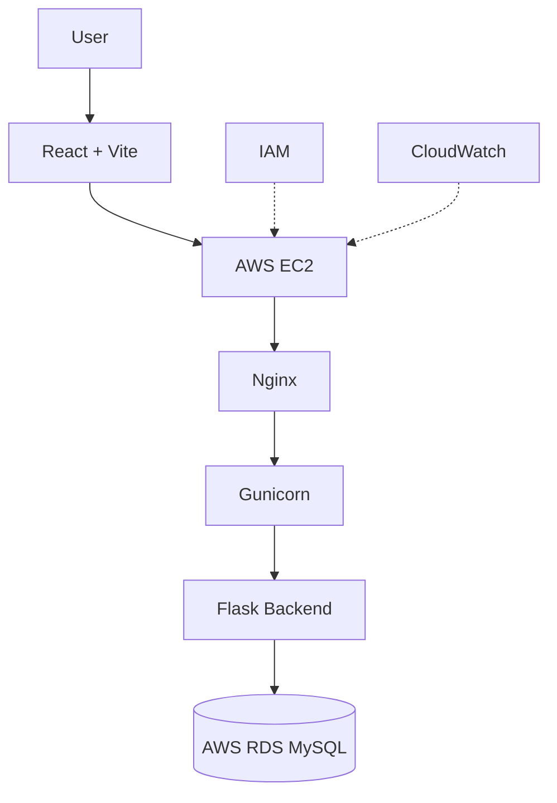

# Slide 4 Notes: System Architecture

## Speaker Notes

The architecture starts with the React + Vite frontend. In AWS, requests reach EC2, pass through Nginx, are served by Gunicorn, handled by Flask APIs, and connected to AWS RDS MySQL. IAM handles access control, and CloudWatch provides monitoring evidence.

## Viva Talking Points

- Nginx is the reverse proxy.
- Gunicorn is the production WSGI server.
- Flask exposes the backend APIs.
- RDS MySQL is the production database target.
- IAM and CloudWatch are supporting AWS services.

## Image Placeholder

`C:/Users/DELL/Documents/ProjectProofs/aws_deployment/nginx_server_status.png`

`C:/Users/DELL/Documents/ProjectProofs/aws_deployment/rds_configuration.png`

## Mermaid

